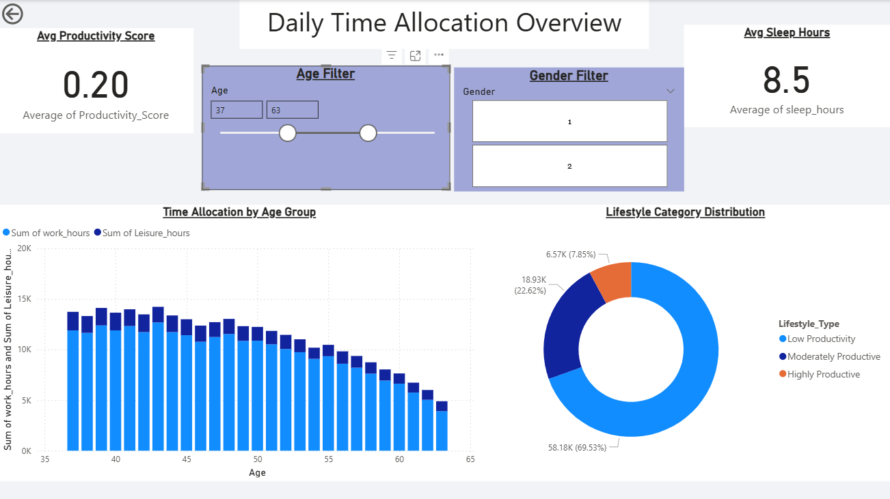

# Lifestyle Time Allocation & Productivity Analysis (Power BI)

## 📌 Project Overview
This project analyzes how daily lifestyle time allocation—such as sleep, work, and leisure—impacts productivity using Power BI.

## 📊 Dataset
- Source: American Time Use Survey (ATUS)
- Type: Public survey data
- Metrics analyzed: Sleep hours, work hours, leisure time, productivity score

## 🧮 Key Metrics Created
- Productivity Score
- Sleep Deficit
- Lifestyle Classification

## 📈 Dashboard Pages
1. Daily Time Allocation Overview
2. Sleep vs Productivity Analysis
3. Lifestyle Optimization Insights

## 🛠 Tools Used
- Power BI
- DAX
- Power Query
- Data Visualization & Analytics

## 📷 Dashboard Preview

## 📂 File
- `.pbix` file included for full interactive dashboard

